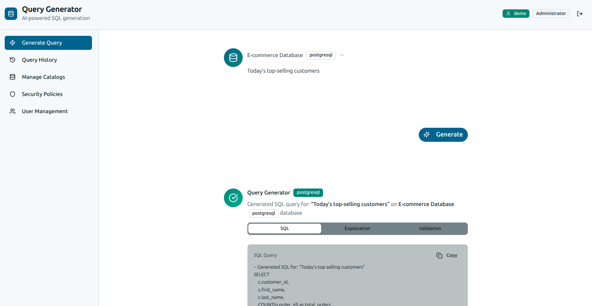

# Query Generator

An AI-powered SQL query generation tool that converts natural language into SQL queries using OpenAI's GPT models and vector embeddings.




## Quick Start

### Prerequisites

- Docker and Docker Compose
- OpenAI API Key

### Setup

1. **Clone the repository**
   ```bash
   git clone https://github.com/Mmd4LIFE/query-generator.git
   cd query-generator
   ```

2. **Configure environment variables**
   ```bash
   cp .env.example .env
   # Edit .env and add your OpenAI API key and other settings
   ```

3. **Start the application**
   ```bash
   docker compose up -d
   ```

4. **Access the application**
   - Frontend: http://localhost:3000 (or your configured FRONTEND_PORT)
   - Backend API: http://localhost:8000 (or your configured BACKEND_PORT)
   - API Documentation: http://localhost:8000/docs (or your configured BACKEND_PORT)
   - Qdrant Dashboard: http://localhost:6333/dashboard

## Configuration

All configuration is managed through the `.env` file. Key settings:

```env
# Required
OPENAI_API_KEY=your_openai_api_key_here
SECRET_KEY=your_secret_key_here

# Admin User (customize as needed)
ADMIN_USERNAME=admin
ADMIN_EMAIL=admin@example.com
ADMIN_PASSWORD=admin123

# PostgreSQL Database
POSTGRES_DB=qg
POSTGRES_USER=qg
POSTGRES_PASSWORD=qg
POSTGRES_PORT=5432

# Qdrant Vector Database
QDRANT_HOST=qdrant
QDRANT_PORT=6333
QDRANT_GRPC_PORT=6334
QDRANT_COLLECTION_NAME=embeddings

# Application Ports
BACKEND_PORT=8000
FRONTEND_PORT=3000

# Embedding Configuration
EMBED_MODEL=text-embedding-3-large
EMBEDDING_DIMENSION=3072
```

## Usage

1. **Login** with the admin credentials (configured in `.env`)
2. **Upload your database schema** by creating a catalog
3. **Add knowledge** about your database (tables, relationships, etc.)
4. **Generate queries** by describing what you want in natural language
5. **Review and execute** the generated SQL

## Architecture

The application uses a microservices architecture with separate services for frontend, backend, relational data, and vector storage:

```
┌─────────────────┐    ┌─────────────────┐    ┌─────────────────┐
│   Frontend      │    │   Backend       │    │   PostgreSQL    │
│   (Next.js)     │◄──►│   (FastAPI)     │◄──►│   (Metadata)    │
│   Port: 3000    │    │   Port: 8000    │    │   Port: 5432    │
└─────────────────┘    └─────────────────┘    └─────────────────┘
                              │
                              │
                              ▼
                       ┌─────────────────┐
                       │     Qdrant      │
                       │ (Vector Store)  │
                       │   Port: 6333    │
                       └─────────────────┘
```

### Technology Stack

- **Frontend**: Next.js (React) with TypeScript
- **Backend**: FastAPI (Python) with async support
- **Relational Database**: PostgreSQL 16 (metadata, user data, catalogs)
- **Vector Database**: Qdrant (embeddings for semantic search)
- **AI Models**: OpenAI GPT-4 and text-embedding-3-large
- **Containerization**: Docker and Docker Compose

### Qdrant Integration

This application uses **Qdrant** as a dedicated vector database for storing and querying embeddings:

- **What it does**: Stores 3072-dimensional embeddings of database schemas, tables, and knowledge items
- **Why Qdrant**: Purpose-built for vector similarity search, provides better performance and scalability than pg_vector
- **How it works**: 
  - PostgreSQL stores metadata (content, IDs, references)
  - Qdrant stores vector embeddings
  - Both databases stay in sync using transaction handling
  - Semantic search queries Qdrant, results are enriched with PostgreSQL metadata

## API Documentation

Once running, visit http://localhost:8000/docs (or your configured BACKEND_PORT) for interactive API documentation.